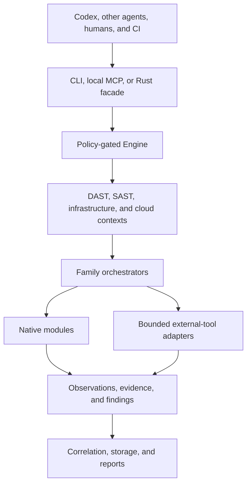

# Architecture overview

ScorchKit is an agent-neutral security execution engine. It owns authorization, effects, scanner
execution, evidence, and reports. Codex is the preferred reasoning host, but CLI, MCP, library, CI,
and other agent hosts use the same engine contracts.

## System boundary



The host may propose work and interpret results. It cannot replace an engagement decision, create a
policy-free execution context, or turn generated analysis into scanner evidence.

## Workspace boundary

Stable policy, domain, configuration, execution, process, family, storage-model, MCP-contract,
CLI-argument, and agent-contract code lives in 13 internal packages under `crates/`. The root
`scorchkit` package composes those contracts with policy-sealed contexts, concrete scanners,
storage adapters, CLI/MCP handlers, reports, and the public binary. Lower packages never depend on
the root package.

See [workspace.md](workspace.md) for the exact package owners, allowed dependency graph, feature
forwarding, and compatibility rules.

## Authorization flow

Every effectful operation starts with an `Engagement`. Its policy contains target rules,
capabilities, exact effect classes, optional denials, enabled state, and expiry.

```text
operator grant
    -> facade target normalization
    -> target/capability/effect decision
    -> policy-sealed context
    -> redirect, DNS, derived-target, path, credential, and process checks
    -> effect
```

The engine denies missing engagements before it constructs an HTTP client, native network
connector, credential-bearing cloud context, filesystem scan context, or scanner process. HTTP and
native resolution authorize the hostname before DNS and every returned address before connection.
Redirects receive a fresh URL decision. External tools receive a capability/effect check at the
shared executor boundary.

See [SECURITY.md](../../SECURITY.md), [engine.md](engine.md), and [config.md](config.md).

## Runtime surfaces

| Surface | Purpose | Boundary |
|---|---|---|
| CLI | Human and CI operation | Reads an engagement from config and uses the facade |
| MCP | Local agent operation over stdio | Uses the same facade, project, and schedule checks |
| Rust facade | Embedded operation | `Engine::for_engagement` or a config containing an engagement |
| AI adapters | Optional planning and analysis | Codex by default; output remains labeled analysis |

Remote MCP transport and outbound webhook delivery are not supported. MCP is local stdio only.

## Engine and contexts

`facade::Engine` is the public construction boundary. It creates private, policy-sealed contexts:

| Context | Target | Primary capability/effect | Shared effect controls |
|---|---|---|---|
| `ScanContext` | HTTP(S) URL | `DastScan`; profile effect | policy HTTP, native resolver, tool executor, hooks |
| `CodeContext` | canonical local path | `CodeScan/Passive` | path grant and tool executor |
| `InfraContext` | host, address, endpoint, or CIDR | `InfraScan/ActiveSafe` | native resolver, TCP/TLS/DNS checks, tool executor |
| `CloudContext` | account, project, subscription, or cluster | `CloudScan/Passive` | credential and external-tool grants |

Contexts carry configuration, shared data, an event bus, and opaque successful decisions. Their
production constructors are internal so callers cannot assemble a context from an arbitrary client
or an unverified target.

## Orchestration and modules

Each family has one orchestrator and one module trait. Orchestrators select modules, enforce bounded
concurrency, publish lifecycle events, run configured local hooks, collect failures without
fabricating findings, and return a `ScanResult`.

The registered production maximum is 125 executable modules:

| Family | Registered modules |
|---|---:|
| DAST and recon | 91 |
| SAST | 24 |
| Infrastructure | 4, plus optional CVE correlation |
| Cloud | 5 bounded external-tool adapters |

Registry contracts in `tests/module_census.rs` own these numbers. Pacu has an implementation but is
not registered. Twelve native AWS, GCP, and Azure SDK modules are private and test-only until their
provider authentication and service requests use a policy-owned transport.

Native production modules use in-process HTTP, parsing, DNS, TCP, or TLS. Tool-backed modules
declare owned invocations and run through the shared executor. Forty-five DAST adapters and 22 SAST
wrappers are bounded one-shot processes. CodeQL uses two ordered bounded processes per applicable
language. Interactsh owns a longer-lived callback session but uses the same process-group ownership
and bounded output primitives.

## Evidence and results

Modules produce structured `Finding` values. `ScanResult` records the scan identity, target,
timestamps, findings, modules run, and modules skipped. Raw scanner evidence is retained. Terminal
escaping changes presentation only, and optional agent analysis is stored separately from evidence.

Reports support terminal, JSON, HTML, SARIF, and PDF output.
PostgreSQL stores projects, scans, findings, schedules, and intelligence. Schedule rows retain the
engagement snapshot used at creation and fail closed if the active policy changes.

## Operational controls

- HTTP destinations, redirects, hostnames, and resolved addresses are authorized before connection.
- Native DNS/TLS/infrastructure hostnames and addresses use the same engagement-aware resolver.
- External processes have executable resolution, timeout, output, exit-policy, process-tree, and
  terminal-rendering controls.
- Scheduled work is claimed with a short `FOR UPDATE SKIP LOCKED` transaction and executes after the
  transaction is released.
- Lifecycle hooks are local processes. Configured hooks require `ExternalTool` authorization.
- CVE providers require separate endpoint and existing cache-path grants.
- Linux and macOS are supported. Windows remains disabled until Job Object cleanup reaches parity.

## Repository delivery architecture

Product code and workflow code use the same evidence rule:

```text
ticket -> plan -> design -> implement -> inspect -> validate -> complete -> delivery gate
```

`CONSTITUTION.md` defines the contract, `bin/pipeline.sh` owns state transitions, `bin/gate.sh` owns
the delivery verdict, and the Git hook checks a receipt bound to the exact worktree. Codex discovers
the repository skill under `.agents/skills`; other hosts call the same scripts and edit the same
ticket/spec/notes/AAR files.

## Detailed documents

- [engine.md](engine.md): facade and context contracts
- [workspace.md](workspace.md): package ownership and dependency direction
- [runner.md](runner.md): orchestration and process execution
- [mcp.md](mcp.md): local agent interface
- [ai.md](ai.md): provider-neutral analysis adapters
- [infra.md](infra.md) and [cloud.md](cloud.md): non-web families
- [storage.md](storage.md): PostgreSQL model
- [report.md](report.md): report outputs
- [ROADMAP.md](../planning/ROADMAP.md): baseline blockers and ordered technical debt
