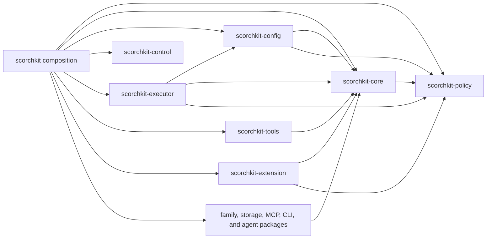

# Cargo workspace boundaries

ScorchKit is a Cargo workspace with 14 internal library packages and one root composition package.
The root `scorchkit` package remains the public library and binary. Existing `scorchkit::...` paths
are compatibility re-exports of package-owned types where a stable contract has moved.

## Package ownership

| Package | Owns | Does not own |
|---|---|---|
| `scorchkit-policy` | engagement, scope, capability, effect, and decision types | clients, contexts, or effect execution |
| `scorchkit-core` | targets, findings, evidence, results, events, correlation, CVE, compliance, and scanner-adapter contracts | CLI, MCP, storage, or agent adapters |
| `scorchkit-extension` | portable guest ABI/protocol plus optional host manifest and SDK contracts | process launch, policy decisions, effects, or persistence |
| `scorchkit-config` | application configuration, credentials, CVE configuration, bounded webhook destinations, and provider-neutral remote MCP shape | effect authorization, HTTP hosting, or delivery execution |
| `scorchkit-control` | versioned control requests, results, errors, schemas, events, cursors, and monotonic run configuration | composition, authorization, storage, transports, or agent providers |
| `scorchkit-executor` | bounded scheduling plus durable job, webhook queue, and store contracts | family orchestration, HTTP, or PostgreSQL queries |
| `scorchkit-tools` | bounded subprocess invocation, output, cancellation, and process ownership | scanner-specific argument construction |
| `scorchkit-web` | DAST/recon category and descriptor vocabulary | contexts, registries, or concrete scanners |
| `scorchkit-code` | SAST category and descriptor vocabulary | code-path authorization or concrete scanners |
| `scorchkit-infra` | infrastructure category and descriptor vocabulary | network contexts or probes |
| `scorchkit-cloud` | cloud category and descriptor vocabulary | credentials, contexts, or provider calls |
| `scorchkit-storage` | stable persistence record models | database connection, queries, or migrations |
| `scorchkit-mcp` | input schemas, server instructions, tool inventory, annotations, and result envelope | transport state or tool business logic |
| `scorchkit-cli` | argument parser, feature-aware commands, and completion generation | command execution or terminal rendering |
| `scorchkit-agent` | host hints, manifest, prompt, and typed reasoning payloads | provider process execution or scan authority |
| `scorchkit` | policy-sealed contexts, registries, concrete adapters, facade, CLI/MCP handlers, storage adapters, and reports | duplicate ownership of extracted contracts |

Family packages intentionally own only stable vocabulary in this extraction. Moving their contexts
would require making crate-private constructors public or redesigning the authorization proof.
Concrete scanners and their policy-sealed contexts therefore remain in `scorchkit` until a later
ticket can move them without widening construction authority.

## Allowed dependency direction

An arrow means the package on the left depends on the package on the right.

The four scanner-family packages depend on `scorchkit-core` for the common adapter descriptor.
Control, storage, MCP, CLI, and agent packages remain independent leaves. No lower package may depend on the
root `scorchkit` package. Exact allowed edges are enforced in `tests/workspace_architecture.rs`.

## Compatibility and features

The root facade preserves existing import paths and type identity. For example,
`scorchkit::Finding` and `scorchkit_core::Finding` are the same Rust type. The same rule applies to
policy, configuration, control, scheduler, job, process, family-category, storage, MCP, CLI, and agent
contracts covered by the architecture test.

Root defaults remain inert. The root forwards `storage`, `mcp`, `control-api`, `team`, `infra`, and
`cloud` only to packages that need those parser or configuration variants. Package extraction
does not authorize a target or enable a stronger effect class.

The optional `team` feature composes `control-api`, storage, Ring AEAD, the team CLI variant, and
the configuration contract only at the root. `scorchkit-control` owns provider-neutral team DTOs;
`scorchkit-config` owns serializable environment references and hard bounds. PostgreSQL,
filesystem, credential, encryption, HTTP, and recovery effects stay in root composition. See
[Authenticated team service](team-service.md).

## Workspace quality contract

The canonical gate runs formatting, Clippy, tests, Rustdoc, coverage, Nextest, Semgrep, source bans,
and mutation inventory across the workspace. Direct development checks should also use
`--workspace` when the command supports it. PostgreSQL and CLI/MCP integration lanes remain rooted
in the `scorchkit` package because they exercise the composed application.

## Optional application outside the workspace

`apps/scorchkit-console` is an independently locked Rustal binary and deliberately declares its own
empty `[workspace]`. It depends only on the stable `scorchkit-control` package plus frontend/client
utilities and the exact reviewed sibling Rustal source. Root `cargo metadata`, builds, tests,
coverage, and mutation inventory contain neither `scorchkit-console` nor Rustal. Its own preflight,
Clippy/tests, browser/render, asset, audit, and dependency-direction contracts provide separate
delivery evidence. See [Rustal local console](rustal-console.md).
